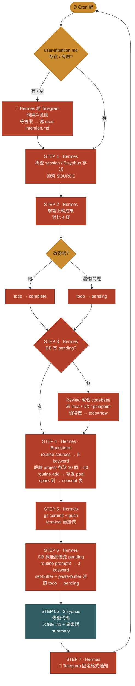
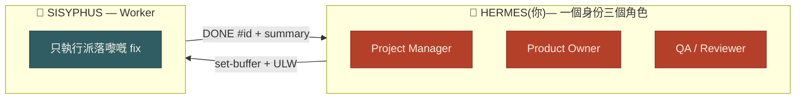
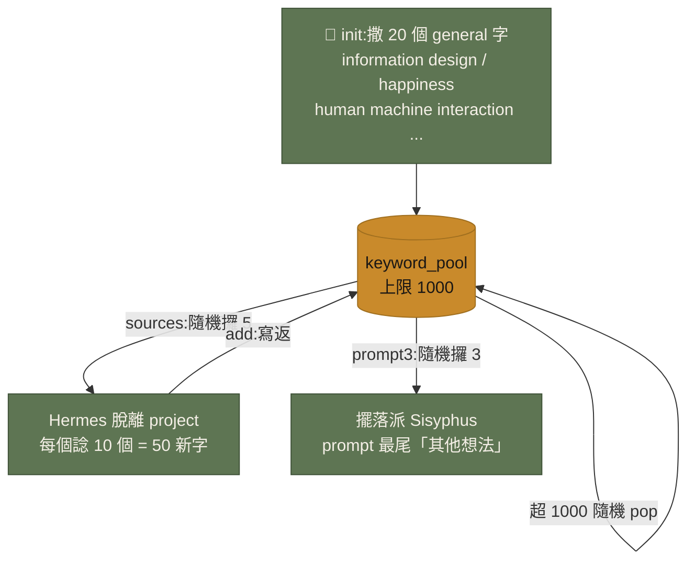
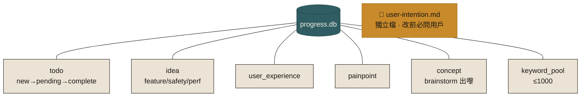

# Hermes ⟷ Sisyphus 自動化系統 — 完整規格 v1

> 一個身份 (Hermes) = PM + Product Owner + QA + Reviewer。Sisyphus = Worker。
> 一日跑 800–1000 次 loop,所以**唔用 vector / embedding**,純 SQLite 文字 + keyword search。
> **cron prompt 一律純文字、零代碼**(因為 Hermes 有 injection safety blocker,prompt 夾代碼會被 block)。
> 所有代碼一次性畀 Hermes 寫入固定文件夾,cron 只係叫佢「跑記憶 / skill 入面嗰段 routine」。

---

## ⚠️ 部署順序(好重要)

1. **一次性 setup(而家,你同 Hermes 傾,唔經 cron)**
   - 叫 Hermes 將下面 **Part 1 (SQL)** 同 **Part 2 (Python)** 寫入一個**固定文件夾**,並**牢記位置**。
   - 建議固定位置:`~/.hermes/autoloop/`
     - `~/.hermes/autoloop/progress.db`(setup 時用 SQL 建好)
     - `~/.hermes/autoloop/loop_routine.py`(pool + DB 操作)
   - Hermes 要將「文件夾位置 + 點 run」寫入自己 memory(你 memory 上限已調到 2 萬,夠用)。
2. **之後每個 cron cycle**
   - cron prompt = **Part 3** 嘅純文字,引用「你 autoloop 文件夾入面嘅 routine」,**唔重複貼代碼** → 過到 safety。

---

## 流程圖(最新)

### 完整 Cron Cycle Loop



### 三個角色都係 Hermes,Sisyphus 淨係 worker



### Keyword Pool 循環(brainstorm)



### DB 六張表 + 一個獨立檔



---

## PART 1 — `progress.db` Schema (SQL,無 vector)

```sql
-- ========= 任務 =========
CREATE TABLE IF NOT EXISTS todo (
    id          INTEGER PRIMARY KEY AUTOINCREMENT,
    title       TEXT    NOT NULL,
    detail      TEXT,                          -- 要改乜、喺邊
    priority    INTEGER NOT NULL DEFAULT 3,    -- 1=HIGH 2=MED 3=LOW
    status      TEXT    NOT NULL DEFAULT 'new',-- new / pending / complete
    source      TEXT,                          -- review / idea / painpoint / concept ...
    created_at  TEXT    NOT NULL DEFAULT (datetime('now')),
    updated_at  TEXT    NOT NULL DEFAULT (datetime('now'))
);

-- ========= 令 product 更好嘅諗法 =========
CREATE TABLE IF NOT EXISTS idea (
    id          INTEGER PRIMARY KEY AUTOINCREMENT,
    category    TEXT,                          -- feature / safety / performance
    content     TEXT    NOT NULL,
    promoted    INTEGER NOT NULL DEFAULT 0,    -- 1 = 已轉成 todo
    created_at  TEXT    NOT NULL DEFAULT (datetime('now'))
);

-- ========= User Experience(前 UIUX)=========
CREATE TABLE IF NOT EXISTS user_experience (
    id          INTEGER PRIMARY KEY AUTOINCREMENT,
    observation TEXT    NOT NULL,
    created_at  TEXT    NOT NULL DEFAULT (datetime('now'))
);

-- ========= 痛點分析 =========
CREATE TABLE IF NOT EXISTS painpoint (
    id          INTEGER PRIMARY KEY AUTOINCREMENT,
    content     TEXT    NOT NULL,
    severity    INTEGER NOT NULL DEFAULT 3,    -- 1 高 .. 3 低
    created_at  TEXT    NOT NULL DEFAULT (datetime('now'))
);

-- ========= Brainstorm 出嚟、值得記低嘅 concept =========
CREATE TABLE IF NOT EXISTS concept (
    id          INTEGER PRIMARY KEY AUTOINCREMENT,
    content     TEXT    NOT NULL,
    keywords    TEXT,                          -- 嗰次用嗰幾個 keyword
    created_at  TEXT    NOT NULL DEFAULT (datetime('now'))
);

-- ========= Keyword Pool(brainstorm 用,存 DB 唔開新 file)=========
CREATE TABLE IF NOT EXISTS keyword_pool (
    id          INTEGER PRIMARY KEY AUTOINCREMENT,
    word        TEXT    NOT NULL UNIQUE,
    created_at  TEXT    NOT NULL DEFAULT (datetime('now'))
);

-- 索引(keyword search 用)
CREATE INDEX IF NOT EXISTS idx_todo_status ON todo(status, priority);
CREATE INDEX IF NOT EXISTS idx_idea_promoted ON idea(promoted);
```

> `user-intention` **唔入 DB**,係獨立檔案 `user-intention.md`(見 Part 3 / Step 1)。

---

## PART 2 — `loop_routine.py`(Hermes 一次性寫入 `~/.hermes/autoloop/`)

> 呢段係**畀 Hermes 寫入文件夾**用,**唔好擺落 cron prompt**。
> 跑法(cron 只用文字叫佢跑):`python3 ~/.hermes/autoloop/loop_routine.py <command>`

```python
#!/usr/bin/env python3
"""
Hermes autoloop routine — keyword pool + DB helpers.
固定位置: ~/.hermes/autoloop/loop_routine.py
DB:       ~/.hermes/autoloop/progress.db
無 vector / 無 embedding,純 SQLite 文字。
"""
import sqlite3, os, sys, random, json

BASE = os.path.expanduser("~/.hermes/autoloop")
DB   = os.path.join(BASE, "progress.db")

POOL_MAX   = 1000   # pool 上限
SEED_KW    = 20     # init 時 seed 幾多個
PICK_SRC   = 5      # 每 cycle 攞幾多個 source keyword 嚟生新字
GEN_PER_KW = 10     # 每個 source keyword 生幾多個新字
USE_IN_PROMPT = 3   # 每 cycle 攞幾多個擺落 prompt 尾「其他想法」

# 一開始 init 嘅 20 個 general keyword
INIT_KEYWORDS = [
    "information design", "happiness", "human machine interaction",
    "inclusive design", "trust", "friction", "memory", "ritual",
    "serendipity", "calm technology", "feedback loop", "affordance",
    "delight", "accessibility", "flow state", "ambient awareness",
    "constraint", "playfulness", "legibility", "resilience",
]

def conn():
    os.makedirs(BASE, exist_ok=True)
    return sqlite3.connect(DB)

def init_pool():
    c = conn(); cur = c.cursor()
    for w in INIT_KEYWORDS:
        cur.execute("INSERT OR IGNORE INTO keyword_pool(word) VALUES (?)", (w.lower(),))
    c.commit(); c.close()
    print(f"pool seeded: {len(INIT_KEYWORDS)} keywords")

def pool_count():
    c = conn(); n = c.execute("SELECT COUNT(*) FROM keyword_pool").fetchone()[0]; c.close()
    return n

def pick_sources():
    """攞 5 個 source keyword 出嚟,等 Hermes 用嚟 brainstorm 新字。"""
    c = conn()
    rows = c.execute("SELECT word FROM keyword_pool ORDER BY RANDOM() LIMIT ?",
                     (PICK_SRC,)).fetchall()
    c.close()
    return [r[0] for r in rows]

def add_words(words):
    """Hermes brainstorm 完(50 個新字)寫返入 pool,超過 1000 隨機刪。"""
    c = conn(); cur = c.cursor()
    for w in words:
        w = w.strip().lower()
        if w:
            cur.execute("INSERT OR IGNORE INTO keyword_pool(word) VALUES (?)", (w,))
    c.commit()
    n = cur.execute("SELECT COUNT(*) FROM keyword_pool").fetchone()[0]
    if n > POOL_MAX:
        over = n - POOL_MAX
        ids = cur.execute("SELECT id FROM keyword_pool ORDER BY RANDOM() LIMIT ?",
                          (over,)).fetchall()
        cur.executemany("DELETE FROM keyword_pool WHERE id=?", ids)
        c.commit()
    c.close()
    print(f"pool now: {min(n, POOL_MAX)}")

def pick_for_prompt():
    """每 cycle 攞 3 個擺落 prompt 尾。"""
    c = conn()
    rows = c.execute("SELECT word FROM keyword_pool ORDER BY RANDOM() LIMIT ?",
                     (USE_IN_PROMPT,)).fetchall()
    c.close()
    return [r[0] for r in rows]

if __name__ == "__main__":
    cmd = sys.argv[1] if len(sys.argv) > 1 else ""
    if cmd == "init":
        init_pool()
    elif cmd == "count":
        print(pool_count())
    elif cmd == "sources":
        print(json.dumps(pick_sources(), ensure_ascii=False))
    elif cmd == "add":
        # python3 loop_routine.py add "word1,word2,word3..."
        add_words(sys.argv[2].split(","))
    elif cmd == "prompt3":
        print(json.dumps(pick_for_prompt(), ensure_ascii=False))
    else:
        print("usage: init | count | sources | add <csv> | prompt3")
```

**Brainstorm 嘅一個 cycle 點行(Hermes 跑):**
1. `python3 loop_routine.py sources` → 攞 5 個 source keyword
2. Hermes **完全脫離 project / 脫離 intention**,每個 source 自由聯想 10 個新字 → 共 50 個
3. `python3 loop_routine.py add "字1,字2,...,字50"` → 寫返入 pool(超 1000 自動隨機刪)
4. `python3 loop_routine.py prompt3` → 攞 3 個,擺落派 Sisyphus 嘅 prompt 最尾「其他想法」

> pool 一開始空 → 第一次 setup 跑 `init` 撒 20 個 general 字(已包含 information design / happiness / human machine interaction / inclusive design 等)。

---

## PART 3 — Hermes Cron Prompt(純文字、零代碼)

> 直接 copy 落 cron。記得改 `[佔位符]`。
> 注意:**冇任何代碼**,只係叫 Hermes 跑佢 autoloop 文件夾入面嘅 routine。

```
你係 Hermes。你同時係呢三個身份,全部都係你:Project Manager + Product Owner + QA / Reviewer。
Sisyphus 係 session 入面嘅 Worker,淨係執行你派嘅任務。
Sisyphus 唔可以保證自己存在、唔可以 review 自己、唔可以決定優先級。
所有 review、判斷、commit、新 idea 都係你做。

你嘅 autoloop 文件夾固定喺:~/.hermes/autoloop/
  - progress.db      (DB)
  - loop_routine.py  (keyword pool + DB routine)
跑 routine 用:python3 ~/.hermes/autoloop/loop_routine.py <command>

變數:
  PROJECT    = [項目名]
  SESSION    = [tmux session]
  REPO       = [代碼路徑]
  TG_CHAT_ID = [Telegram chat id]

== 每個 CRON CYCLE 嚴格按步行 ==

STEP 0 — 意圖 gate(只第一次)
  如果 REPO 入面 user-intention.md 唔存在或者空:
    你必須停低,主動經 Telegram 問返用戶呢個 project 嘅意圖同邊界,
    等佢答完先將佢嘅答案寫入 user-intention.md。
    呢個係新 project 第一次先做,之後唔好再問,除非用戶主動講要改。
  如果已經有 user-intention.md:直接讀,唔好再問。
  (user-intention 嘅作用係框住你,唔好飄走去做無關嘅嘢。)

STEP 1 — 檢查存活 + 讀齊 SOURCE(你做)
  - 確認 SESSION 同 Sisyphus 存在;唔存在 → cd 入 REPO 重開 session + 啟動 worker。
  - 讀:Sisyphus pane 回應、progress.db 嘅 todo/idea/painpoint/concept、
        REPO 本次修正代碼區、user-intention.md、idea.md。

STEP 2 — 驗證上一輪成果(你做)
  對比四樣:① Sisyphus 回應 ② 代碼文件夾本次改動真係改咗冇、合唔合理
           ③ user-intention.md ④ idea.md。
  - 改得啱      → 該 todo 轉 complete
  - 做漏/有問題  → 該 todo 轉返 pending

STEP 3 — REVIEW + 更新分析(你做)
  - 如果 DB 冇 pending → 你主動 review 成個 codebase 搵新 issue,
    順便諗 feature / safety / performance、user_experience 觀察、painpoint。
  - 寫入對應 DB 表(idea / user_experience / painpoint)。值得做嘅寫入 todo(status=new)。

STEP 4 — BRAINSTORM(每 cycle 最多一次)
  - 跑:loop_routine.py sources  → 攞 5 個 source keyword
  - 你完全脫離 project、脫離 intention,純自由聯想:每個 source 諗 10 個新 keyword(共 50 個)
  - 跑:loop_routine.py add "<50個字逗號分隔>"  → 寫返 pool(超 1000 自動隨機刪)
  - 如果嗰次聯想有真係 spark 到嘅諗法,寫入 concept 表。

STEP 5 — COMMIT / PUSH(你做,唔經 Sisyphus)
  - 上一輪驗收 complete 嘅改動,你喺 terminal:
    git add -A && git commit -m "..." && git push
  - 理由:Sisyphus session 可能 commit 前中斷,你做最可靠。

STEP 6 — 派任務畀 Sisyphus(你做)
  - 由 DB 揀最高優先級嘅 pending(或新 new)任務。
  - 跑:loop_routine.py prompt3  → 攞 3 個 keyword 做「其他想法」。
  - 用 set-buffer + paste-buffer 派(格式見下,prompt 最尾一定要有 ULW)。
  - 該任務標記為 pending。

STEP 7 — 發 TELEGRAM(你做,精簡,固定格式)
  發到 TG_CHAT_ID,唔好詳細,只用以下格式:
  🍼 [PROJECT] · HH:MM
  ✅ Done: #id 標題
  🔧 Dispatched: #id 標題
  📋 TODO: n pending · n new
  📦 Commit: hash → pushed
  📝 Desc: <廣東話、精簡、非技術:做咗咩、改咗咩、成果點>

完 → 下個 cron cycle 返 STEP 0/1。

鐵規則:
 - 永遠唔好叫 Sisyphus "review and report",佢只做 "fix"。
 - Review、判斷、commit 一定你做。
 - 冇新改動就唔好重覆派同一個 review task。
 - 派出去一律 set-buffer + paste-buffer,prompt 尾必加 ULW。
 - user-intention 改之前一定要問過用戶。
```

---

## PART 4 — 派畀 Sisyphus 嘅固定格式

> Sisyphus 好強,**唔使**話佢改邊啲 file。最尾**必加 `ULW`**(trigger Ulterworker mode,起 subagent,做快啲)。

**派任務(Hermes set-buffer 出去):**
```
TASK #<id>: <一句明確目標,例如:修復 cvs.py user_id=1 hardcoded + CV endpoints 加 auth>
唔好 review,做完即可。

其他想法: <keyword1>, <keyword2>, <keyword3>

ULW
```

**Sisyphus 交返(畀 Hermes 驗,固定格式):**
```
DONE #<id>
Modified: +X -Y
Summary: <一句廣東話,改咗乜>
```

---

## 一覽:邊個做乜

| 步驟 | 由邊個做 |
|---|---|
| 問 user-intention(只第一次) | Hermes → 問用戶 |
| 讀三/四個 source | Hermes |
| 驗證上輪成果 | Hermes |
| review codebase + 寫 idea/UX/painpoint | Hermes |
| brainstorm keyword pool | Hermes |
| commit / push | Hermes(terminal) |
| 派任務 | Hermes(set-buffer + ULW) |
| 修復代碼 | Sisyphus |
| Telegram 通知 | Hermes |
